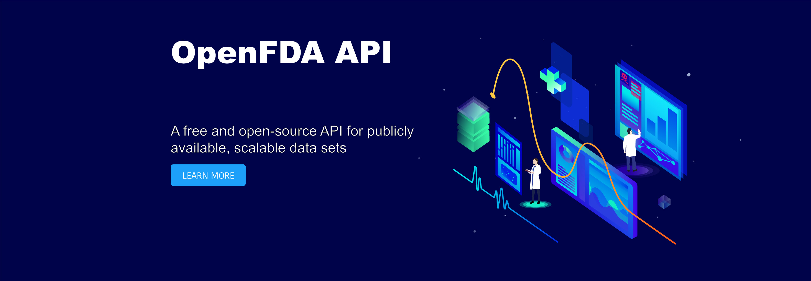

# FD Reports

A proof of concept app that demonstrates the use of the public [openFDA](https://open.fda.gov/) API and data visualization with [chart.js](https://www.chartjs.org/). Selected datasets are for Adverse Events and Recall enforcements regarding food, drugs, and devices in the U.S.

See demo [here](https://fd-reports.netlify.com/)

[](https://open.fda.gov/)

## React version

15.5.4


## Setting up Locally

Clone project
```
git clone https://github.com/justinh5/FD-Reports.git
```

Run dev server
```
npm run start
```
Navigate to http://localhost:8080

## Testing with Jest

```
npm test
```


## License

This project is licensed under the MIT License.
